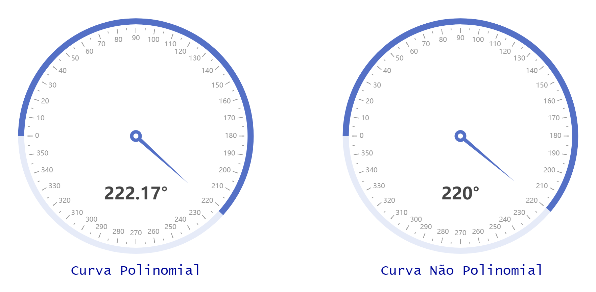

<h1 align="center">
  
</h1>

<h2 align="center">Caracterização estática de um potenciômetro como sensor de posição angular</h2>

## 👨‍💻 Tecnologias Utilizadas

- [Arduino]
- [Comunicação Serial]
- [Node.js]
- [Socket.io]

## 🔧 Recursos
* Transmissão dos dados coletados pelo Arduino por meio da Comunicação Serial
* Envio dos dados obtidos pela aplicação Node.js para aplicação web por meio de uma Comunicação via Socket (Socket.io)
* Visualização do ângulo estimado pela curva de caracterização estática utilizando um gráfico Gauge

## ❓ Como Usar

### [1] Configuração do Arduino

#### Para executar a aplicação em Node.js, primeiro se faz necessário montar o circuito e configurar as curvas no arquivo (arduino/arduino_code.ino), seguindo o que foi descrito no relátorio. Após, essa configuração é possível seguir os outros passos.

### [2] Configurar a porta de comunicação

#### Antes de iniciar a aplicação é necessário alterar no arquivo index.js a string 'COM7' para a porta a qual o Arduino está conectado.

### [3] Instação e execução da aplicação Node.js

```bash
$ cd potentiometer-viewer
$ npm install
$ npm start
```

## 💻 Visualização da aplicação

<h1 align="center">
  
</h1>

<br>

<p align="center">
Created by Bruno Lemos.
</p>
